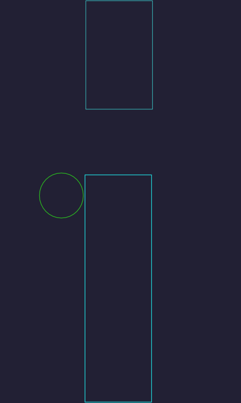
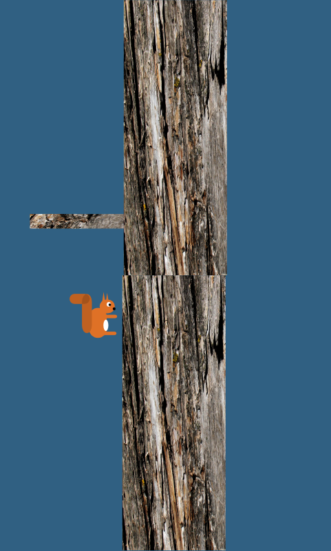
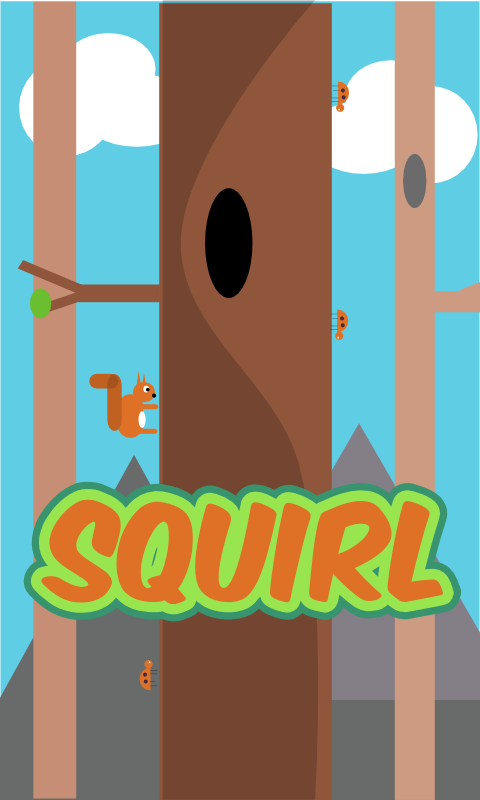

Starting to get somewhere now with the new project. I thought it would be interesting to
show the evolution of the idea from a graphical standpoint.

The last image isn't the finished product, it still needs some work, but it's nice to finally see something that looks more like a game and less like some random shapes...

Oh and I switched technology again, but I'll leave out the gory details. I've gone back to libGDX, but I'm using an entity component system (Ashley), and writing in Kotlin.
