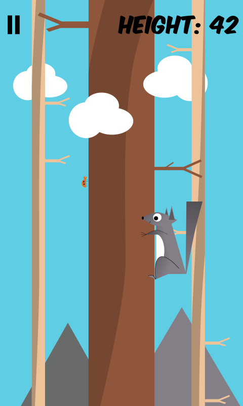

Another release - this time an iOS (iPhone) exclusive!

The first pic is one of the original prototype images, before much work had been done on the game. The other two are the title screen and an in-game shot from the released version.

Written in [Kotlin](https://kotlinlang.org/), using [libGDX](https://libgdx.badlogicgames.com/) and [Ashley](https://github.com/libgdx/ashley/wiki).

[RoboVM](https://robovm.com/) for compilation.

All graphics created in [Inkscape](https://inkscape.org) and [GIMP](https://www.gimp.org/).

Music created in [Sunvox](http://www.warmplace.ru/soft/sunvox/), original tune by [Clockwork Mitten](http://clockworkmitten.com).

Available now on the iOS App Store!

Download, play, and tell your friends!

Many thanks,

art
